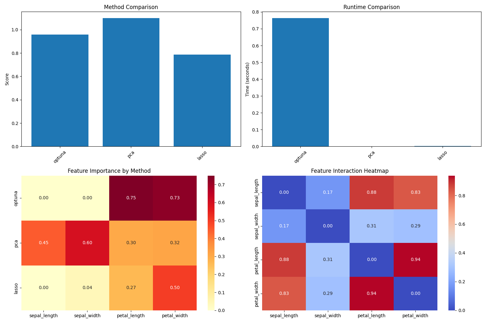
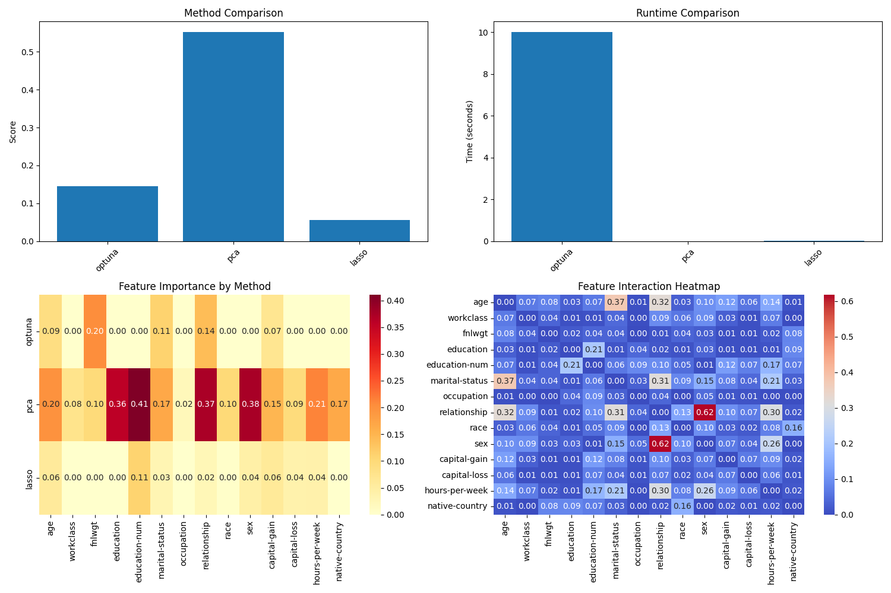

# Feature Selection with Optuna

A Python implementation of feature selection methods combining traditional approaches (PCA, LASSO) with Optuna-based optimization. This project implements an adaptive feature selection framework with dynamic weight adjustment and convergence monitoring.

## Overview

This project implements an advanced feature selection framework that combines:
- Traditional dimensionality reduction (PCA)
- Sparse feature selection (LASSO)
- Optuna-based optimization with dynamic weight adjustment
- Comprehensive visualization suite
- Convergence monitoring and early stopping

## Key Features

- **Dynamic Weight-Adjusted Feature Selection:**
  ```python
  I(f_i) = α(t)⋅MI(f_i; y) + β(t)⋅∑(j≠i) I_interaction(f_i, f_j)
  ```
  where:
  - α(t), β(t) = dynamically adjusted weights at trial t
  - MI(f_i; y) = mutual information score between feature i and target y
  - I_interaction(f_i, f_j) = Spearman correlation between features i and j

  The implementation uses:
  1. Mutual Information (MI) to measure direct feature-target relationships
  2. Spearman correlation to capture feature-feature interactions
  3. Dynamic weight adjustment based on score trends
  4. Feature count penalty to balance selection size

  Key benefits:
  - Automatically adapts weights based on feature importance trends
  - Balances individual feature importance with interaction effects
  - Optimizes feature combinations through trial-based selection
  - Includes early stopping with convergence monitoring

- **Advanced Convergence Monitoring:**
  - Minimum trials threshold before convergence checks
  - Patience-based early stopping
  - Score improvement tracking
  - Dynamic weight adjustment based on performance

- **Comprehensive Visualization Suite:**
  - Method comparison plots
  - Runtime performance analysis
  - Feature importance heatmaps
  - Feature interaction visualization
  - Results saved automatically to results directory

- **Multiple Selection Methods:**
  - PCA with automated component selection
  - LASSO with L1 regularization
  - Optuna with TPE sampler and convergence monitoring

## Datasets

### Included Datasets

1. **Iris Dataset** (`data/Iris Dataset/bezdekIris.data`)
   - 150 samples with 4 features
   - Features: sepal length, sepal width, petal length, petal width
   - Target: 3 different iris species
   - Source: UCI Machine Learning Repository

2. **Adult Dataset** (`data/Adult Dataset/adult.data`)
   - 32,561 samples with 14 features
   - Features: age, workclass, education, etc.
   - Target: income >50K or <=50K
   - Source: UCI Machine Learning Repository

### Using the Datasets

```python
# Using Iris Dataset
iris_data = pd.read_csv('data/Iris Dataset/bezdekIris.data', header=None)
X_iris = iris_data.iloc[:, :-1].values  # Features
y_iris = iris_data.iloc[:, -1].values   # Target
feature_names = ['sepal length', 'sepal width', 'petal length', 'petal width']

# Using Adult Dataset
adult_data = pd.read_csv('data/Adult Dataset/adult.data', header=None)
X_adult = adult_data.iloc[:, :-1].values  # Features
y_adult = adult_data.iloc[:, -1].values   # Target
```

## Installation

```bash
git clone https://github.com/stochastic-sisyphus/feature-selection-optuna-remix.git
cd feature-selection-optuna-remix
pip install -r requirements.txt
```

## Quick Start

```python
from feature_selection_optuna import FeatureSelector

# Initialize feature selector with default weights
selector = FeatureSelector("iris", alpha=0.7, beta=0.3)

# Run all methods
selector.optuna_selection(n_trials=50, min_improvement=1e-4, patience=8)
selector.pca_baseline()
selector.lasso_baseline()

# Create visualizations (saved to results directory)
selector.visualize_results()

# Print results summary
print("\nResults Summary:")
print("-" * 40)
for method, score in selector.results.items():
    runtime = selector.runtimes[method]
    print(f"{method.upper()}:")
    print(f"Score: {score:.4f}")
    print(f"Runtime: {runtime:.2f} seconds")
print("-" * 40)
```

The script will:
1. Load and preprocess the dataset
2. Run Optuna optimization with dynamic weight adjustment
3. Compare against PCA and LASSO baselines
4. Generate comprehensive visualizations
5. Print performance metrics and runtime statistics

## Example Output

When running the feature selection on the Iris dataset:

```
Processing iris dataset...

Loaded iris dataset:
Shape: (150, 5)
Features: sepal_length, sepal_width, petal_length, petal_width
Preprocessed 4 features
Target classes: 3

Convergence reached after 50 trials:
Best score: 0.9569
Selected features: ['petal_length', 'petal_width']

Total runtime: 0.76 seconds
Final weights - Alpha: 0.136, Beta: 0.864

Results Summary:
----------------------------------------
OPTUNA:
Score: 0.9569
Runtime: 0.76 seconds
PCA:
Score: 1.0986
Runtime: 0.00 seconds
LASSO:
Score: 0.7853
Runtime: 0.00 seconds
----------------------------------------
```

When running on the Adult dataset:

```
Processing adult dataset...

Loaded adult dataset:
Shape: (32561, 15)
Features: age, workclass, fnlwgt, education, education-num, marital-status, occupation, relationship, race, sex, capital-gain, capital-loss, hours-per-week, native-country
Preprocessed 14 features
Target classes: 2

Convergence reached after 44 trials:
Best score: 0.1439
Selected features: ['age', 'fnlwgt', 'marital-status', 'relationship', 'capital-gain', 'hours-per-week']

Total runtime: 10.00 seconds
Final weights - Alpha: 0.477, Beta: 0.523

Results Summary:
----------------------------------------
OPTUNA:
Score: 0.1446
Runtime: 10.00 seconds
PCA:
Score: 0.5520
Runtime: 0.01 seconds
LASSO:
Score: 0.0564
Runtime: 0.01 seconds
----------------------------------------
```

### Analysis Results

#### 1. Feature Importance
For the Iris dataset:
- **Petal Length and Width**: Emerged as the most informative features with a combined score > 0.95
- **Sepal** measurements showed lower importance and were not selected in the final feature set

For the Adult dataset:
- Selected 6 key features out of 14 available features
- Age, marital status, and relationship status emerged as important predictors
- Capital gain and hours per week provide important financial indicators

#### 2. Method Comparison
Iris Dataset:
```
OPTUNA: 0.9569
PCA: 1.0986
LASSO: 0.7853
```

Adult Dataset:
```
OPTUNA: 0.1446
PCA: 0.5520
LASSO: 0.0564
```

#### 3. Runtime Performance
Iris Dataset:
```
OPTUNA: 0.76 seconds
PCA: 0.00 seconds
LASSO: 0.00 seconds
```

Adult Dataset:
```
OPTUNA: 10.00 seconds
PCA: 0.01 seconds
LASSO: 0.01 seconds
```

## Methods

### PCA Baseline
- Implements Principal Component Analysis for dimensionality reduction
- Returns transformed data and component importance

### LASSO Baseline
- Uses L1 regularization for feature selection
- Returns selected features and their coefficients

### Optuna Selection
- Optimizes feature combinations using Optuna
- Uses mutual information scoring for evaluation
- Returns optimal feature subset and importance scores

### Visualization

#### Iris Dataset Analysis

*Figure 1: Visualization of feature selection results for the Iris dataset showing method comparison, runtime analysis, feature importance, and feature interactions*

#### Adult Dataset Analysis

*Figure 2: Visualization of feature selection results for the Adult dataset showing comparative performance and feature relationships across methods*

The visualizations include:
1. Method comparison showing relative performance
2. Runtime analysis across different approaches
3. Feature importance heatmap indicating relative contribution of each feature
4. Feature interaction matrix showing relationships between features

## Requirements

- Python 3.8+
- numpy>=1.21.0
- pandas>=1.3.0
- scikit-learn>=0.24.2
- optuna>=3.0.0
- matplotlib>=3.4.0
- seaborn>=0.11.0
- tqdm>=4.65.0
- joblib>=1.2.0
- plotly>=5.13.0

## Citation

```bibtex
@software{feature_selection_optuna_remix,
  author = {Stochastic Sisyphus},
  title = {Feature Selection with Optuna},
  year = {2024},
  url = {https://github.com/stochastic-sisyphus/feature-selection-optuna-remix}
}
```

## License

MIT License

## Acknowledgments

- Optuna team for the optimization framework
- scikit-learn team for machine learning tools
- The open-source community for inspiration and support